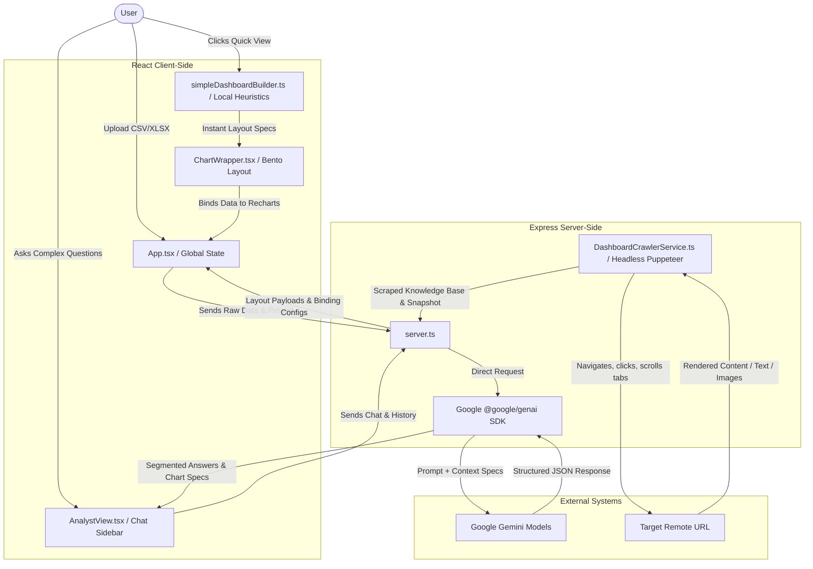

# ⚡ Dash-Dost: Conversational Analytics & Interactive Dashboard Builder

[](https://github.com/dostam/dash-dost)
[](https://www.typescriptlang.org/)
[](https://react.dev/)
[](https://vite.dev/)
[](https://tailwindcss.com/)
[](https://ai.google.dev/)
[](https://pptr.dev/)

> **Your Raw Data, Transformed Conversationally.** Turn messy, chaotic CSVs, Excel sheets, and static live dashboards into professional, highly interactive, and beautifully composed visual workspaces in seconds. Powered by Google Gemini and a robust client-side fuzzy data-binding engine.

---

## 🌟 Overview

**Dash-Dost** (Dashboard Friend) is a modern, full-stack conversational analytics workspace that breaks down the barrier between raw data and business intelligence. Instead of constructing tedious pivot tables, writing complex SQL queries, or dealing with rigid layouts, you simply talk to your data.

Dash-Dost handles the entire analytics lifecycle: it profiles dataset columns, normalizes messy values, matches fuzzy queries to actual dataset headers, generates responsive bento-grid layouts, and supports conversational deep dives with a grounded virtual analyst. If you need immediate results without AI latency, the **⚡ Quick View** engine bypasses the network entirely, mapping numerical, categorical, and chronological metrics into interactive charts in **under 100 milliseconds**.

---

## 📖 Table of Contents

- [⚡ Dash-Dost: Conversational Analytics \& Interactive Dashboard Builder](#-dash-dost-conversational-analytics--interactive-dashboard-builder)
  - [🌟 Overview](#-overview)
  - [📖 Table of Contents](#-table-of-contents)
  - [✨ Key Features](#-key-features)
  - [🏗️ System Architecture \& Data Flow](#️-system-architecture--data-flow)
  - [🛠️ Tech Stack \& Dependencies](#️-tech-stack--dependencies)
  - [📂 Project Structure](#-project-structure)
  - [🚀 Getting Started](#-getting-started)
    - [Prerequisites](#prerequisites)
    - [Installation \& Configuration](#installation--configuration)
    - [Environment Variables](#environment-variables)
    - [Running the Development Server](#running-the-development-server)
    - [Production Build \& Execution](#production-build--execution)
    - [Available Scripts](#available-scripts)
  - [🔌 API Reference](#-api-reference)
  - [🧠 AI \& LLM Architecture](#-ai--llm-architecture)
    - [Tiered Grounding Hierarchy](#tiered-grounding-hierarchy)
    - [Multi-Intent Segmentation Rule](#multi-intent-segmentation-rule)
    - [Inline Ephemeral Chart Spec Generation](#inline-ephemeral-chart-spec-generation)
  - [📸 UI Tour / Placeholders](#-ui-tour--placeholders)
  - [🧪 Code Quality \& Validation](#-code-quality--validation)
  - [🤝 Contributing](#-contributing)
  - [📜 License](#-license)
  - [💖 Acknowledgements](#-acknowledgements)

---

## ✨ Key Features

*   **💬 Conversational Dashboard Synthesis**: Describe what you want to visualize in plain English (e.g., *"Show me total revenue as a KPI, a line chart of sales over time, and a bar chart of regions"*). Dash-Dost generates beautiful layouts containing bound, responsive Recharts widgets.
*   **⚡ Zero-LLM "Quick View" Mode**: Skip AI roundtrips. A powerful client-side heuristic engine analyzes data shapes, categories, and numerical metrics to build a comprehensive, ready-to-use dashboard in milliseconds.
*   **🧩 High-Fidelity Multi-Intent Q&A**: Enter compound questions like *"What's our Q3 revenue? Also compare region A vs B, and why did churn drop?"* The virtual analyst segments these into independent queries, returning a tailored, multi-card answer layout with distinct sources and KPIs.
*   **📊 Inline Chat-Only Ephemeral Charts**: Sub-answers with comparative or trend-based metrics automatically generate line, bar, area, or pie charts rendered *inside the chat bubble*. These charts are ephemeral and do not clutter your live dashboard until you click **"📊 Show as Chart"** or promote them.
*   **🕷️ Browser-Based Deep Dashboard Crawler**: Input any public or authenticated dashboard URL. Dash-Dost spins up a server-side headless browser (Puppeteer) to crawl through up to 15 tabs and sub-pages, bypass loading states, scroll dynamically to trigger charts, and aggregate text and visual intelligence.
*   **🖼️ Screenshot Intelligence OCR**: Drop a visual capture of any existing dashboard or spreadsheet. The system extracts tabular data, coordinates UI widgets, identifies trends, and produces a highly accurate visual markdown dossier.
*   **🔗 Intelligent Fuzzy Data Binder**: Standardizes loose column references from LLM payloads (e.g., `"revenue"`, `"sales"`) against actual, complex spreadsheet columns (e.g., `"Net Revenue (USD)"` or `"Sales_Q2_Final"`), using fuzzy matching and semantic mapping.
*   **🛡️ KPI Guardrails \& Safe Aggregations**: KPI cards automatically handle noisy string formatted values (like `$`, `%`, commas, or missing cells). If no numeric aggregation is possible, cards fall back to standard counts or row counts gracefully.
*   **🍰 High-Cardinality Pie Chart Clamping**: Protects pie charts from rendering unreadable, micro-sized slices. It automatically ranks values and groups lower-frequency entries into an *"Other"* category once slices exceed 8.

---

## 🏗️ System Architecture & Data Flow

Dash-Dost is architected as a full-stack Node.js and React application with custom browser scraping and AI reasoning capabilities.



---

## 🛠️ Tech Stack & Dependencies

*   **Core Framework**: [React 19](https://react.dev/) + [TypeScript](https://www.typescriptlang.org/) + [Vite 6](https://vite.dev/)
*   **Styling \& Layout**: [Tailwind CSS v4](https://tailwindcss.com/) with a bespoke **Cosmic Dark Slate** color scheme, [Motion](https://motion.dev/) for smooth animations, and `@dnd-kit` for interactive layout sorting.
*   **Visualization Engine**: [Recharts](https://recharts.org/) (Line, Bar, Area, Pie, Scatter, Maps) with gradient prefix isolation to prevent multi-chart rendering collisions.
*   **Server Architecture**: [Express 4](https://expressjs.com/) configured with standard Node.js server-side TypeScript execution via `tsx` and bundled using `esbuild`.
*   **AI Integration**: [@google/genai SDK v2.4.0](https://www.npmjs.com/package/@google/genai) utilizing `gemini-flash-latest` (Gemini Flash) models.
*   **Headless Crawling**: [Puppeteer](https://pptr.dev/) with viewport scrolling, dynamic tab clicking heuristics, and screenshot extraction pipelines.
*   **Local Caching**: `IndexedDB` handled via `idb-keyval` for persistent caching of processed datasets and generated layouts.
*   **Data Processors**: `PapaParse` for rapid CSV processing, and `XLSX` (SheetJS) for Excel reading.

---

## 📂 Project Structure

```text
├── server.ts                       # Full-stack Express server (Gemini API, OCR, Puppeteer scrapers, and router)
├── package.json                    # Dependencies, scripts, and build tasks
├── metadata.json                   # Applet permissions, metadata, and cloud capability tags
├── tsconfig.json                   # TypeScript configuration
├── vite.config.ts                  # Vite compilation, aliases, and Tailwind integration
├── .env.example                    # Environment variable configurations
│
├── /src
│   ├── main.tsx                    # Client-side entrypoint
│   ├── App.tsx                     # Main application layout, file drop-zone, and dashboard render grid
│   ├── index.css                   # Global Tailwind CSS entrypoint with custom Cosmic Dark variables
│   ├── types.ts                    # Consolidated TypeScript interfaces (Charts, Payloads, QA schemas)
│   ├── store.ts                    # Global UI state store (Zustand)
│   │
│   ├── /components                 # Visual components and modals
│   │   ├── AnalystView.tsx         # Floating conversational Analyst side-drawer with voice capabilities
│   │   ├── ChartWrapper.tsx        # Dynamic Recharts engine (KPI, Line, Bar, Pie, Scatter, Maps)
│   │   ├── CompareTrendsPanel.tsx  # Interactive side-by-side dataset overlay and comparison controller
│   │   ├── ConversationalPanel.tsx # Conversation streams, prompt centers, and historical managers
│   │   ├── DashboardSkeleton.tsx  # Smooth animated layout loaders
│   │   ├── EditComponentModal.tsx  # In-situ editor to modify widget type, math overlays, and titles
│   │   ├── EditFilterModal.tsx     # Custom categorical slicing and filter customizer
│   │   ├── FiltersPanel.tsx        # Persistent dashboard active filter controls
│   │   ├── GeographyMap.tsx        # React-Simple-Maps renderer for geographic metadata binding
│   │   ├── InlineChatChart.tsx     # Compact, read-only Recharts widget specifically designed for chat bubbles
│   │   ├── SavedDashboardsManager.tsx # Persistent IndexedDB dashboard manager
│   │   └── SuggestionChips.tsx     # Context-aware conversational starter chips
│   │
│   ├── /services                   # Full-stack service integrations
│   │   └── DashboardCrawlerService.ts # Puppeteer-based recursive tab and iframe web scraper
│   │
│   ├── /utils                      # Pure utility functions and mathematical engines
│   │   ├── anomalyDetector.ts      # Statistical anomaly flags and outlier highlights
│   │   ├── calculatedFields.ts     # Client-side data derivation helper
│   │   ├── dataBinder.ts           # Semantic column binder, aggregations, and fuzzy matcher
│   │   ├── dataNormalization.ts    # String and currency cleaner
│   │   ├── dataProfiler.ts         # Fast data cardinality, types, and summary generator
│   │   ├── filterEngine.ts         # Multiprocessor categorical data subset mapper
│   │   ├── jsonRepair.ts           # Recursive regex-based LLM JSON string bracket repair tool
│   │   ├── queryEngine.ts          # In-memory natural query dataset parser
│   │   ├── schemaValidation.ts     # Validation safeguards for LLM output structures
│   │   └── simpleDashboardBuilder.ts # Client-side quick-dashboard template generator
│
└── /public                         # Static files and fallback assets
```

---

## 🚀 Getting Started

### Prerequisites

*   [Node.js](https://nodejs.org/) v18.0.0 or higher
*   A Google AI Studio [Gemini API Key](https://aistudio.google.com/)

### Installation & Configuration

1.  Clone the repository:
    ```bash
    git clone https://github.com/dostam/dash-dost.git
    cd dash-dost
    ```
2.  Install dependencies:
    ```bash
    npm install
    ```

### Environment Variables

Copy the `.env.example` file to create your local `.env`:
```bash
cp .env.example .env
```
Ensure you provide your Gemini API key:
```env
GEMINI_API_KEY="AI_Studio_API_Key_Here"
APP_URL="http://localhost:3000"
```

### Running the Development Server

Start the development server:
```bash
npm run dev
```
The application will boot in development mode, mounting Vite as an active middleware proxy inside the Express server on **port 3000** at `http://localhost:3000`.

### Production Build & Execution

To bundle the application for production:
```bash
# Build the client static assets (Vite) and server (esbuild bundle)
npm run build

# Start the compiled server
npm start
```
The compiled server is bundled as a single, self-contained CommonJS file located at `dist/server.cjs`, guaranteeing fast, dependency-isolated cold-starts.

### Available Scripts

| Script | Command | Purpose |
| :--- | :--- | :--- |
| **`npm run dev`** | `tsx server.ts` | Launches the hot-reloading Express server on port 3000 in dev mode. |
| **`npm run build`** | `vite build && esbuild ...` | Compiles client assets and bundles server code into `dist/server.cjs`. |
| **`npm run start`** | `node dist/server.cjs` | Runs the compiled production-ready server. |
| **`npm run clean`** | `rm -rf dist` | Wipes build artifacts. |
| **`npm run lint`** | `tsc --noEmit` | Performs comprehensive TypeScript validation checks. |

---

## 🔌 API Reference

### `GET /api/health`
Verifies server connectivity and environment readiness.

### `POST /api/generate`
Generates full dashboard layouts and component configurations from profiled datasets.
*   **Request Body**:
    ```json
    {
      "profile": { "columns": [{ "name": "Sales", "type": "numeric" }] },
      "prompt": "Create a executive overview",
      "history": []
    }
    ```
*   **Response**: Fully bound layout configuration JSON (`DashboardPayload`).

### `POST /api/ingest-url`
Spins up headless Puppeteer to recursively crawl, snap, and extract data from external analytical dashboards.
*   **Request Body**:
    ```json
    {
      "url": "https://public.tableau.com/..."
    }
    ```
*   **Response**: Markdown text representation, structured knowledge-base pages, and extracted visual structures.

### `POST /api/ingest-screenshot`
Leverages Gemini vision models to perform structural OCR and layout mapping on dashboard snapshots.
*   **Request Body**:
    ```json
    {
      "screenshot": "data:image/png;base64,..."
    }
    ```
*   **Response**: Markdown dossiers and bounding coordinate specifications.

### `POST /api/analyst-chat`
Handles natural language Q&A, historical contexts, and dynamic ephemeral chart plotting.
*   **Request Body**:
    ```json
    {
      "message": "What is total sales? Compare regions as a bar chart.",
      "conversationHistory": [],
      "datasetContext": { "columns": [], "rows": [] },
      "dashboardDefinition": { "components": [] },
      "activeFilterState": {},
      "knowledgeBase": [],
      "intelligenceReport": ""
    }
    ```
*   **Response**: Highly structured `AnalystChatResponse` containing segmented answers, grounded source citations, and inline Recharts specifications.

---

## 🧠 AI & LLM Architecture

Dash-Dost employs a state-of-the-art **Grounded Multi-Source Reasoning Pipeline** that guarantees response precision while completely preventing hallucinated statistics.

### Tiered Grounding Hierarchy

The AI prompt forces a strict, sequential confidence evaluation across four distinct information sources:
1.  **Tier 1: Dashboard Definition (`dashboard_definition`)** — Real chart data, active filters, series coordinates.
2.  **Tier 2: Dataset Context (`dataset_context`)** — Direct row aggregations and column statistics.
3.  **Tier 3: Crawled Knowledge Base (`knowledge_base`)** — Scraped texts from remote links/tabs.
4.  **Tier 4: Screenshot OCR (`screenshot_ocr`)** — Static visual evidence (flagged with a lower confidence rating in the UI).

### Multi-Intent Segmentation Rule

A specialized pre-processing prompt block analyzes compound user messages and splits them into distinct sub-questions. 

```text
Message: "What was total sales in Q3, how does it compare to Q2, and why did churn drop?"
                     │
                     ▼
           [Segmentation Engine]
                     │
       ┌─────────────┼─────────────┐
       ▼             ▼             ▼
 [Sub-Question 1] [Sub-Question 2] [Sub-Question 3]
  "Total Sales"   "Q2 vs Q3"        "Why Churn Drop"
 (single_kpi)     (comparison)      (explanation)
```

Each segment maps to its own `AnalystSubAnswer` object, carrying its own metrics, confidence ratings, and data sources.

### Inline Ephemeral Chart Spec Generation

If an answer is comparative or chronological, the LLM produces a declarative `InlineChartSpec` JSON block. The frontend parses this spec to dynamically generate responsive, read-only Recharts on-the-fly inside the chat thread. If confidence is low, the system provides a **"📊 Show as Chart"** chip, letting the user render the visual at will without making extra network requests.

---

## 📸 UI Tour / Placeholders

### High-Fidelity Bento Grid Workspace
The main workspace organizes widgets into responsive grids. It supports interactive dragging and live-rebuilding when resizing.
```
┌───────────────────────────┬───────────────────────────┐
│     Total Sales KPI       │      Average Margin       │
│        ₹45.2 Lakhs        │           18.2%           │
├───────────────────────────┴───────────────────────────┤
│                                                       │
│             Monthly Revenue Timeline (Area)           │
│                                                       │
└───────────────────────────────────────────────────────┘
```

### Context-Aware Conversations & Chat Cards
Chat answers render beautifully inline as separate, clean visual cards complete with KPI spotlights and source references.
```
┌───────────────────────────────────────────────────────┐
│ 💬 User: "Total sales vs Q2?"                          │
├───────────────────────────────────────────────────────┤
│ 🤖 Assistant:                                         │
│                                                       │
│ ┌───────────────────────────────────────────────────┐ │
│ │ • Sub-Answer 1: Total sales has grown by 12.5%.   │ │
│ │                                                   │ │
│ │   [ Bar Chart: Sales Comparison by Quarter ]      │ │
│ │                                                   │ │
│ │   Sources Used: [dashboard_definition]            │ │
│ └───────────────────────────────────────────────────┘ │
└───────────────────────────────────────────────────────┘
```

---

## 🧪 Code Quality & Validation

We maintain strict type safety and syntax validation. Ensure you run validation checks before contributing code changes:

```bash
# Verify there are no compilation or TypeScript errors
npm run lint

# Confirm the application bundles successfully
npm run build
```

---

## 🤝 Contributing

We are excited about open-source collaboration! To contribute:
1.  Fork the repository.
2.  Create a feature branch (`git checkout -b feature/amazing-feature`).
3.  Ensure your code is strictly typed and adheres to standard patterns.
4.  Verify your changes pass `npm run lint` and `npm run build`.
5.  Open a Pull Request describing your changes.

---

## 📜 License

Distributed under the MIT License. See `LICENSE` for more information.

---

## 💖 Acknowledgements

*   **Google AI Studio** for state-of-the-art model APIs.
*   **Recharts** for premium, modular SVG visualizers.
*   **Puppeteer** for robust browser scraping capabilities.

---
*Dash-Dost — Turn numbers into narratives, conversationally.*
